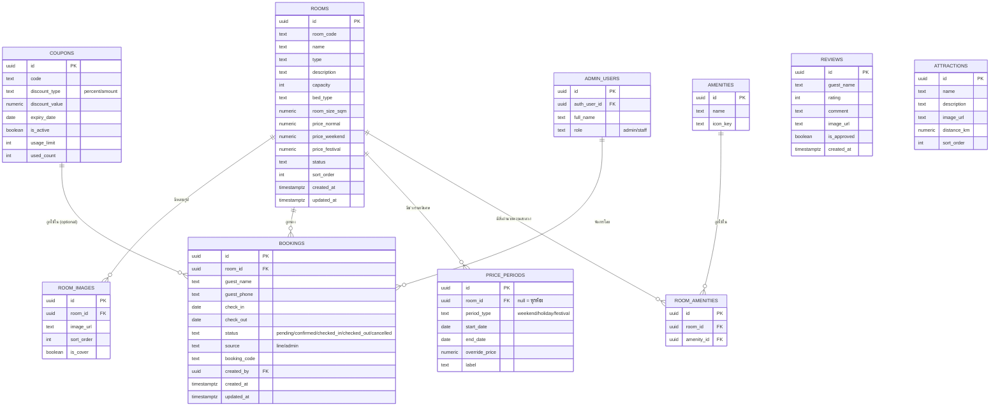

# ER Diagram — บ้านสีขาวริมโขง ธาตุพนม

## คำอธิบายตารางหลัก

- **rooms** — ข้อมูลห้องพักหลัก ราคา 3 แบบ (ปกติ/วันหยุด/เทศกาล) ใช้เป็นค่าตั้งต้น ส่วนราคาช่วงพิเศษเฉพาะวันดูจาก `price_periods`
- **room_images** — เก็บ URL รูปจาก Supabase Storage bucket `room-images` รองรับหลายรูปต่อห้อง
- **bookings** — ใช้บันทึกการจองที่รับผ่าน LINE โดยแอดมิน กรอกเข้าระบบเพื่อ "บล็อกวันที่" ในปฏิทิน ป้องกัน Double Booking (ไม่ใช่ระบบจองออนไลน์ที่ลูกค้าจองเอง)
- **price_periods** — ใช้กำหนดวันหยุดยาว/เทศกาลที่ราคาต่างจากปกติ เช่น สงกรานต์ ปีใหม่
- **coupons** — โปรโมชั่นส่วนลด ใช้อ้างอิงตอนแอดมินออกใบจอง
- **reviews** — รีวิวลูกค้า ต้องผ่านการอนุมัติ (`is_approved`) ก่อนแสดงหน้าเว็บ
- **attractions** — สถานที่ท่องเที่ยวใกล้เคียง จัดการผ่าน Admin ได้เหมือนกัน
